**<h1> AGILE MANIFESTO </h1>**


## <span style="color:#555555"><u> **PROCESS** </u></span>

It is essential we maintain the following cadence in our software development life cycle in order to remain agile and adapt plans when necessary.

### <span style="color:orange"> Timeline </span>

<details>
  <summary><span style="color:hotpink"> KEY </span></summary>

- 👨‍💻 = DEV
- 👨‍🚀 = QA
- 🕵 = BSA
- 📆* = Sprint Ceremony
- ✅ = Sign-off
- 🚫 = Cut-off
- 🎬 = Demo

``` mermaid
gantt
title Timeline & Milestones
dateFormat YYYY-MM-DD

section Pre-Sprint
Prev Sprint :  z1, 2022-12-26, 5d
📆 :crit,  2022-12-28, 3d
🌮🌮🌮 :crit, active, 2022-12-31, 2d

section Week 1
Week 1 :  a1, 2023-01-02, 5d
📆 :milestone, active, 2023-01-02, 1d
📆👨‍🚀🕵 :milestone, active, 2023-01-03, 1d
📆 :milestone, active, 2023-01-04, 1d
🌮🌮🌮 :crit, active, after a1, 2d

section Week 2
Week 2 :  b1, 2023-01-09, 5d
📆 :milestone, active, 2023-01-11, 1d
✅ :milestone, active, 2023-01-13, 1d
🌮🌮🌮 :crit, active, after b1, 2d

section Week 3
Week 3 :  c1, 2023-01-16, 5d
📆 :milestone, active, 2023-01-18, 1d
👨‍🚀🕵✅  :crit, done, 2023-01-16, 5d
🚫🆕👨‍💻👨‍🚀 :crit, 2023-01-17, 4d
📆🎬 :milestone, active, 2023-01-20, 1d
🌮🌮🌮 :crit, active, after c1, 2d

```

</details>



- 📆* Reoccurring Sprint Ceremonies:
<span style="color:#67DAFF">
  - **1st Monday = Sprint Planning**
  - **1st Tuesday = Automation Planning**
  - **Every Wednesday = Grooming**
  - **2nd Friday = Sprint Sign-Off**
  - **Last Tuesday of Every Sprint = Code Cut-off**
  - **Last Week of Every Sprint = QA/UAT Sign-Off**
  - **Last Friday = Retro & Demo**
</span>


### <span style="color:orange"> Flow </span>


## <span style="color:#555555"><u> **TASK LISTS** </u></span>

<details>
  <summary><span style="color:green">Sprint</span> Checklist <span style="color:#b2ffc8"><small>- per/Sprint</small></summary>

- Before
  - [ ] Establish sprint goals and objectives
  - [ ] Gather requirements and user stories
  - [ ] Assign tasks to team members
  - [ ] Set up sprint planning meeting
- During
  - [ ] Monitor progress and provide feedback
  - [ ] Identify and address any blockers
  - [ ] Conduct daily stand-up meetings
- After
  - [ ] Review sprint results and lessons learned

</details>


<details>
  <summary><span style="color:red">Scrum Master</span> Checklist <span style="color:#FF5757"><small>- per/Day</small></summary>

- [ ] Hold daily stand-up meeting with the team
  - Individual Recaps <span style="color:lightblue"><small>- 15min</small></span>
  - Review Dashboards --> Scrum + Security + Automation <span style="color:lightblue"><small>- 5min</small></span>
  - Parking Lots <span style="color:lightblue"><small>- 5min</small></span>
  - Reminders & Callouts e.g. assigned tasks, hours, burndown, board mgmt <span style="color:lightblue"><small>- 5min</small></span>
- [ ] Monitor progress of tasks and ensure deadlines are met
- [ ] Facilitate communication between team members
- [ ] Identify and remove any impediments to progress 
- [ ] Monitor team velocity and adjust sprints accordingly
- [ ] Track and report on team progress
  - Update *Scrum Dashboard as needed
  - Update *[Sprint Banner](https://learn.microsoft.com/en-us/azure/devops/organizations/settings/manage-banners?view=azure-devops) as needed
- [ ] Provide guidance and support to the team as needed

<small>* pending implementation</small>

</details>


<details>
  <summary><span style="color:gold">Individual Contributor</span> Checklist <span style="color:#FFEE57"><small>- per/Day</small></summary>

- [ ] Update Taskboard & Hours AM <span style="color:lightblue"><small>- 15min</small></span>
- [ ] Review and respond to emails <span style="color:lightblue"><small>- 30min</small></span>
- [ ] Set personal daily goals <span style="color:lightblue"><small>- 15min</small></span>
- [ ] Execute assigned tasks and goals
- [ ] Document affecting changes
- [ ] Review daily work <span style="color:lightblue"><small>- 15min</small></span>
- [ ] Personal growth, research, and/or swarm <span style="color:lightblue"><small>- 30min</small></span>
- [ ] Update Taskboard & Hours PM <span style="color:lightblue"><small>- 15min</small></span>

</details>


## <span style="color:#555555"><u> **PRINCIPLES** </u></span>
Our overarching goal as a team is to serve our customers/the Bank through continuous and consistent delivery of quality, valuable software/products.

As we mature as a team, we will continue to update and refine this document so that, as opposed to a prescriptive desktop procedure, it serves as a strong foundation to level set expectations. We will utilize the _Scrum_ framework as our foundation and as a team, we will strive to meet the following principles when collaborating on all software development projects.

- Visibility/Transparency
Involved parties will work together as a unit, to stay accountable to follow-through of responsibilities and to agree upon expectations.

- Inspection
Scrum Team members should meet and communicate frequently to inspect Scrum artifacts and progress toward accomplishing the requirements of each Sprint.

- Adaptation
Scrum Team members should consistently seek out new ideas and opportunities to learn, remaining open minded and receptive to change.


## <span style="color:#555555"><u> **PRACTICES** </u></span>

### <span style="color:orange"> Requirements Gathering and Product Backlog Maintenance </span>

The creation of a product backlog and management. This process should outline the product's purpose, its features, functionalities, and behavior.

- Accountable
    - Product owner(s) and stakeholders meet to discuss high-level project requirements. Timeframe to complete this milestone depends on the complexity of the project.
      -  Small : 1-2 weeks; Med: 2-3 weeks; Large : 3-5 weeks or more 
    - Product Owner and business analysts should work collectively to define business requirements and prioritization in product backlog 
      - Business requirements led and owned by Channel owner
  - Development team and business analysts should work collectively to define technical requirements and prioritization in product backlog
    - Technical requirements led and owned by API owner
  - Development Team leaders are responsible for maintaining the Tech CI backlog used for improving development workflow and application infrastructure and tools.


- Involved
  - Product Owner
  - Business Analyst
  - Stakeholders
  - Development Team Leads

- Output
  - Clearly defined product requirements
    - Analysis of overall goal, pain points, must have features, regulatory requirements etc.
  - Product Backlog Maintenance with focus on getting them to a Definition of Ready state
    -  New Epics/Features/Stories/PBIs in DevOps
          - Inclusive of defined acceptance criteria
    -  Technical Debt identified when applicable
  -  Reprioritization and ordering of Product Backlog work items
     -  All roles are expected to create and maintain Story and PBI level work items
  - Test Plans
    -  Should contain a comprehensive set of test cases that validate both happy and negative scenarios for new functionality


- Not Included
  - Solutioning / Technical Specifications

- Timing
  - Continuous
    - The backlog is the living documentation that supports the product. Output items should continuously be reviewed to support the Scrum teams cadence.  


Please use the following references for more information: 
- [Product Implementation Workflow VSDX](Src/assets/Product-Implementation-Workflow.vsdx)


### <span style="color:orange"> Product Backlog Grooming </span>

#### <span style="color:#8855ff"> Pre-Grooming </span>

- <small>[Story Sizer](https://scrum.reedtaylor.org/) by Reed Taylor</small> 


The purpose is to ensure the development team understands and estimates items in the Product Backlog and shows what the Scrum Team will work on in future Sprints.

- Accountable
  - Scrum Master and Product Owners review Product backlog to ensure PBIs are clearly defined for sprint planning work to begin
  - Development Team is responsible for sizing and asking clarifying questions

- Involved
  - Scrum Team

- Output
  - Product backlog is visible, transparent, and clear to all
    - Definitions and Acceptance Criteria documented/defined
    - Goal is to have enough items groomed for up to two sprints
  - Higher ordered items are clearer and more detailed than lower ordered items
  - Approved PBI's
    - "sized" in preparation of next Sprint Planning event

- Not Included
  - Ordering/Prioritization of Product Backlog
  - Sprint backlog grooming

- Timing
  - Standing weekly one-hour meeting (opposed to long/less frequent meetings)


#### <span style="color:#67DAFF"> TAGGING </span>
To generate the full list of Tags utilized within our DevProjects group in Azure DevOps, you can generate a [Personal Access Token](https://learn.microsoft.com/en-us/azure/devops/organizations/accounts/use-personal-access-tokens-to-authenticate?view=azure-devops&tabs=Windows) w/Read access to our Azure Work Items, then use that token in the following PowerShell script:

``` ps
$AzureDevOpsPAT = "<replace w/your access token>"
$OrganizationName = "Made/DevProjects"

$AzureDevOpsAuthenicationHeader = @{Authorization = 'Basic ' + [Convert]::ToBase64String([Text.Encoding]::ASCII.GetBytes(":$($AzureDevOpsPAT)")) }

$UriOrga = "https://dev.azure.com/$($OrganizationName)/" 
$uriAccount = $UriOrga + "_apis/wit/tags?api-version=7.0"

$response = Invoke-RestMethod -Uri $uriAccount -Method get -Headers $AzureDevOpsAuthenicationHeader 
$response | ConvertTo-Json
```

...or enter the following URL into your browser (not formatted): `https://dev.azure.com/<company>/<project>/_apis/wit/tags?api-version=7.0`

**Please use the expandable dropdown to further define and manage relevant tags:** 

<details>
  <summary><span style="color:hotpink"> PRODUCT BACKLOG </span></summary>

- <span style="color:hotpink"> Portal </span> - related to the Portal UI side of PartnerPortal.
- <span style="color:hotpink"> Back Office </span> - related to the Back Office UI side of PartnerPortal.
- <span style="color:hotpink"> Planning </span> - to be planned, e.g. requirements gathering.
- <span style="color:hotpink"> Grooming </span> - to be groomed, see Product Backlog Grooming section above.
- <span style="color:hotpink"> Ready to Test </span> - Means that all requirements of PBI (including added tasks for found bugs) are ready to test in the QA environment. Along with changing the PBI to ready to test, the developer must also notify the tester that the PBI is ready to test. If the fixes will be published on the next QA release, the developer may still change the PBI state to `Ready To Test` as long as the notification to the tester includes when the fixes will be available.
- <span style="color:hotpink"> v2 </span> - related to PartnerPortal API v2.
- <span style="color:hotpink"> v3 </span> - related to PartnerPortal API v3.
- <span style="color:hotpink"> <Project Name> [e.g Discovery] </span> - to track all efforts for a particular project that spans multiple release cycles.
- <span style="color:hotpink"> <Release Name> [e.g. Gemstone] </span> - to track all efforts for a particular release.
- <span style="color:hotpink"> <UAT Cycle> [e.g. Test Plan] </span> - specific UAT iteration or cycle name to track testing efforts for a release.
- <span style="color:hotpink"> Security </span> - Automatically tagged from Cyprus scanning
- <span style="color:red"> Urgent Security Patch </span> - **IMMEDIATE** security action required
</details>


<details>
  <summary><span style="color:mediumpurple"> AUTOMATION BACKLOG </span></summary>

Query-based Test Suites will be using several identifiers to validate which Test Cases qualify to be imported. 
 
**NOTES:**
- Automation tags will always start with <span style="color:mediumpurple"> [@]_ </span> 
- Test Suites will always be appended with <span style="color:mediumpurple"> .Suite </span> 
   - Must include an additional 'area' tag to define which side of Partner Portal (<span style="color:mediumpurple"> [@]_PORTAL </span> or <span style="color:mediumpurple"> [@]_BACK.OFFICE </span>) the test covers 

**UPDATE:** defines which automated test cases are to be updated or modified 
- Work Item Type = Microsoft.TestCaseCategory | Tag = <span style="color:mediumpurple"> [@]_Update </span> | Automation Status = Automated

**API:** defines which automated test cases are to be updated or modified for API validation
- Work Item Type = Microsoft.TestCaseCategory | Tag = <span style="color:mediumpurple"> [@]_API </span> | Automation Status = Automated

**FGPP:** defines which automated test cases are to be updated or modified for downstream Finastra validation
- Work Item Type = Microsoft.TestCaseCategory | Tag = <span style="color:mediumpurple"> [@]_Finastra </span> | Automation Status = Automated

**AUTOMATE:** defines which manual test cases are to be automated
- Work Item Type = Microsoft.TestCaseCategory | Tag = <span style="color:mediumpurple"> [@]_Automate </span> | Automation Status = Not Automated

**REGRESSION:** defines which automated test cases are to be run in nightly regression 
- Work Item Type = Microsoft.TestCaseCategory | Tag = <span style="color:mediumpurple"> [@]_Regression </span> | Automation Status = Automated  

To further define which Test Suite folder each Test Case should fall under, use the tagging reference below...

- <span style="color:mediumpurple"> [@]_PORTAL </span>
   - <span style="color:mediumpurple"> [@]_INT.Suite </span>
   - <span style="color:mediumpurple"> [@]_PAY.Suite </span>
   - <span style="color:mediumpurple"> [@]_SEN.Suite </span>	 

- <span style="color:mediumpurple"> [@]_BACK.OFFICE </span>
   - <span style="color:mediumpurple"> [@]_Limit.Suite </span>
   - <span style="color:mediumpurple"> [@]_Profile.Suite </span>
   - <span style="color:mediumpurple"> [@]_Subscription.Suite </span>
</details>


### <span style="color:orange"> Sprint Planning </span>


Scrum Team collaborates and discusses the highest-ordered backlog items to be included in the next scheduled Sprint ensuring that the goals and scope are understood by everyone on the Team as well as possible. 

- Accountable
  - The Scrum Master ensures that the event takes place and that attendants understand its purpose
  - The development team has the final say in which PBI's it will commit to for the Sprint
    - The development team should also work towards prioritizing PBI’s so that higher prioritized items are worked on first
  - All Work Items should be assigned in a Sprint
    - All tasks should be created and have hours associated with them within 48 hours of the start of the sprint. The Work Item owner is responsible for task creation and hour allocation.

- Involved
  - Scrum Team

- Output
  - Sprint Timeframe
  - Sprint Goal
  - Sprint Backlog
    - Committed PBI’s
  - PBI Initial Task Creation

- Not Included
  - Ordering/Prioritization of Product Backlog
  - Resizing PBI’s

- Timing
  - A one to two-hour meeting on the day of or one day prior to start of next Sprint


### <span style="color:orange"> Sprint </span>

During each Sprint, the Scrum Team works together to complete a potentially releasable product increment. The goal is to have most PBIs included in the Sprint meet the definition of "done". As we move towards better understanding the team's velocity, we will determine if we will bring in extra items that we may not be able to achieve. The goal should be to release work from the sprint at the end of the sprint by utilizing tools such as feature flags to hide code that is not ready to be used in production.

- Accountable
  - Development Team is responsible for transforming PBIs into working, tangible products/features
  - Scrum Master ensures Sprint team is staying on task
  - PBI and Task owners responsible for
    - Updating their remaining task hours at the end of the day
    - Updating the Sprint backlog statuses as items are completed and moving `Done` items to the bottom of the Sprint backlog
      - All PBIs in a sprint need to be in at least the `Committed` State and must be groomed.
      - PBIs that are `Ready To Test` should be changed to that status and relevant testers notified. (See `Ready to Test` definition below)
      - PBIs that are finished testing should be changed to `Done` if there are no other remaining tasks.
        - If Bugs are found, create a new Task if relevant PBI is still open, otherwise create a new bug with a Related link to the original PBI.
  - PBI and Task owners responsible for maintaining Sprint Backlog
  - Product owners and business analysts are available to answer clarifying questions

- Involved
  - Scrum Team

- Output
  - Tasks are updated daily in Dev Ops by respective owner
    - Remaining work (hours) is updated by end of day
  - Only the items in Sprint Backlog are worked on
  - Code check-ins are associated to PBIs and Tasks
  - Test Plans and Scripts
  - Useable, and potentially releasable product increment

- Not Included
  - Items that were not committed to in Sprint Planning

- Timing
  - Fixed timeframe determined during Sprint Planning (currently 3 weeks)
    - Changes to timeframe during Sprint should be rare


### <span style="color:orange"> Daily Stand-Up </span>

This event is held every day of the Sprint to optimize team collaboration and performance by inspecting the work since the last Daily Scrum and forecasting upcoming Sprint work.

- Accountable
  - Scrum Master and Development Team


- Involved
  - Scrum Master and Development Team (required)
  - Entire Scrum Team (optional)
  - Stakeholders

- Output
  - What was accomplished yesterday that is related to the current Sprint
  - What will be worked on today that is related to the current Sprint
  - Highlighted Blockers
  - Parking Lot Discussions
    - Consider commitment changes in current Sprint; this should be avoided when possible
    - Discussions estimated to take longer than 15 minutes, should be scheduled for a different meeting


- Not Involved
  - Problem solving/Longer discussions 
    - should be taken offline with relevant parties
  - Stakeholders are welcomed to meetings, but should keep discussion items to Parking Lot discussions


- Timing
  - Daily, not longer than a 30-minute meeting
    <span style="color:#67DAFF">
    - **15 min - Individual Recaps**
    - **5min - Review Dashboards**
    - **5min - Parking Lots**
    - **5min - Reminders & Callouts**
  </span>


### <span style="color:orange"> Sprint Review/Demo </span>

The Sprint review is an opportunity for stakeholders to discuss and inspect functionality completed in the Sprint.

- Accountable
  - Product Owner and Stakeholders should attend every Sprint review in the spirit of transparency and continuous feedback
  - Development Team
    - Members of the development team that completed an increment of work or have work to demo

- Involved
  - Scrum Team
  - Stakeholders

- Output
  - Completed PBIs
    - must be fully tested and meet the definition of done
  - Demonstration of functionality
  - Adapt the Product Backlog as needed based on feedback provided
  - Product Owner has the option to release any of the completed functionality

- Not Included
  - Discussion on the process of the Sprint

- Timing
  - Should occur either near or at the end of every Sprint, meeting length should be as much time as needed, up to one hour


### <span style="color:orange"> Sprint Retrospective </span>

<small>[ICE BREAKERS](https://www.mentimeter.com/app)</small>

The Scrum Team discusses the process including what went right and areas for improvement in the Sprint. This is action focused, not rational focused.

- Accountable
  - The Scrum Master should facilitate the meeting and conversation asking all members of the Sprint to participate

- Involved
  - Scrum Team

- Output
  - Tangible plan for implementing improvements to the way the Scrum Team does its work and/or improvements to practices or definitions
  - Possible updates to the Agile Manifesto

- Not Included
  - Finger pointing
  - Outputs from other Scrum Ceremonies/Events

- Timing
  - Meeting on the last day or near the end of every Sprint, meeting length should be as much time as needed, up to 45 minutes


## <span style="color:#555555"> **DEFINITIONS** </span>

Because we all have a different experience level when working with teams using Agile methodologies, we should all set to utilize the below set of terms and definitions when working on software or product projects.

<details>
  <summary><span style="color:hotpink"> EXPAND </span></summary>

- **Accountable**:
Roles called out under this section are expected to produce the output items as well as any pre-work required to achieve them.

- **Blocker**:
Also known as impediments, are anything blocking or slowing the team from doing its work.

- **Daily Standup**:
Meeting with the Development Team and Scrum Master to discuss tasks completed to achieve the Sprint Goal and identify any known blockers. Other members of the Scrum team may attend as needed.

- **Definition of Ready**:
Work items are clearly defined and immediately actionable.

- **Epic**:
Highest level of categorization of work items in Dev Ops. They require a large size of work that has one common objective. Epics can include one or many features, stories, PBIs. Typically, several sprints are required to complete an Epic.

- **Feature**:
A collection of related product backlog items and/or bugs highlighting functionality that delivers business value.

- **Minimum Viable Product (MVP)**:
Bare minimum product that must be delivered. The goal is to deliver a working product to customer to receive feedback so that future efforts can be tailored accordingly.

- **Product Backlog**:
Product Backlog is an ordered list of all work items that are known to be needed in a product. It is constantly evolving and is never complete.

- **Product Backlog Item (PBI)**:
A distinct piece of functionality that has yet to be delivered for a product. PBIs can include business and/or technical requirements and enhancements.

- **PBI Definition of Done**:
Shared understanding of what it means for a PBI to be complete, to ensure transparency. At minimum the following must be completed prior to end of each Sprint.
	- Tasks are complete
	- Acceptance Criteria is met

- **Product Increment**:
Product Increment is the summation of all Product Backlog items completed during a Sprint and the value of the increments of all previous Sprints.

- **Product Owner/Team**:
Subject matter expert(s) responsible for defining the product and product features. This role is expected to incorporate stakeholder feedback to create the MVP increments every Sprint. Product Owners maintain the product backlog and prioritization.

- **Ready To Test**:
Means that all requirements of PBI (including added tasks for found bugs) are ready to test in the QA environment. Along with changing the PBI to ready to test, the developer must also notify the tester that the PBI is ready to test. If the fixes will be published on the next QA release, the developer may still change the PBI state to `Ready To Test` as long as the notification to the tester includes when the fixes will be available.

- **Rough Order of Magnitude (ROM)**:
Means that PBIs are immediately actionable. The Team must be able to determine what needs to be done and the amount of work required to complete the item.

- **Scrum Artifacts**:
Scrum artifacts are summarized as the Product Backlog, Sprint Backlog, and Product Increments.

- **Scrum Event**:
Also known as Ceremonies, a Scrum event includes the following practices which should be completed with every Sprint: Sprint Planning, Daily Standup, Sprint Review, and Sprint Retrospective.

- **Scrum Master**:
Protects the team from both internal and external distractions; holds the Scrum Team accountable to set principles, practices, and to the Scrum framework itself.

- **Scrum Team**:
Inclusive of the responsible parties involved in the Sprint from beginning to end:
	- Product Owners
	- Business Analysts
	- Development Team
	- Scrum Master
	- Project Manager

- **Sizing**:
Relative estimation to help determine the development team's velocity. This is not a time estimation rather a complexity estimation. Sizing standards are as follows:
	Fibonacci sizing/T-shirt sizing conversion
	- 13 (XXL) – Too large, consider breaking down into smaller items or rolling up to a higher categorized item
	- 8 (XL) – Highest complexity for a PBI
	- 5 (L), 3 (M), 2 (S)
	- 1 (XS) – Lowest complexity for a PBI

- **Sprint**:
A dedicated timeframe, between 1 and 4 weeks but typically 2 weeks, where the Scrum Team works together to complete PBIs. Sprints happen one right after the other, with no breaks, to maintain a steady project cadence.

- **Sprint Backlog**:
List of PBIs that the team commits to achieve in each Sprint. Once created, no one can add to the Sprint Backlog except the Development Team.

- **Sprint Goal**:
An objective set for the Sprint that can be met through the implementation of Product Backlog work items.

- **Stakeholder(s)**:
All internal parties affected by changes to business processes including new product implementations and changes to existing products.

- **Stories**:
Stories are inclusive of user stories and enabling (technical) stories.

- **User Stories:**
User stories should be created from the "user" persona, for example: As "\_\_\_\_\_" I need "\_\_\_\_" so that I can "\_\_\_\_".

- **Work Items:**
All types of work that exist in the product including epics, features, stories, PBIs, enhancements, bug fixes, and tasks.

</details>


## <span style="color:#555555"> **RESOURCES** </span>
[Agile Manifesto](https://www.scrumalliance.org/resources/agile-manifesto)
[Scrum Values](https://www.scrumalliance.org/about-scrum/values)
[Scrum Framework](https://www.scrumalliance.org/about-scrum/framework)
