**<h1> AUTOMATION MANIFESTO </h1>**


## <span style="color:#555555"><u> **OVERVIEW** </u></span>

TestComplete (SmartBear Software) is an open test platform for easily creating, maintaining, and executing automated tests for desktop, Web, mobile, and client-server software applications. TestComplete is especially useful for teams using continuous integration and development--integrating seamlessly with popular 3rd party applications, source control, test management and CI tools.

Kitt, LLC is leveraging this solution for Partner Portal, FGPP, and Payments API automated regression testing, which is run via Azure Pipelines on both Self-Hosted and Microsoft-Hosted Agents. The Kitt, LLC test strategy will follow the guidelines set fourth and defined by [Microsoft’s Test Management Workflow](https://docs.microsoft.com/en-us/azure/devops/test/create-a-test-plan?view=azure-devops).

<span style="color:#A6A6A6"> **PIPELINES** </span>

1. <u>Regression</u> - runs the [Portal Regression Automation] Test Suite from the specified Azure Test Plan.
   - QA
     - Name: [tc-automation-qa-regression]
     - Schedule: **<span style="color:green">Monday - Thursday @ 4:00AM EST</span>**
   - STG
     - Name: [tc-automation-stg-regression]
     - Schedule: **<span style="color:green">Tuesday & Thursday @ 7:00AM EST</span>**
2. <u>All</u> - runs all [Portal Regression Automation] Test Suites from the specified Azure Test Plan.
   - QA
     - Name: [tc-automation-qa-all]
     - Schedule: **<span style="color:green">Friday @ 4:00AM EST</span>**
   - STG
     - Name: [tc-automation-stg-all]
     - Schedule: **<span style="color:green">Friday @ 7:00AM EST</span>**

<span style="color:#A6A6A6"> **DASHBOARD** </span>
[TestComplete Automation] - DevProjects

## <span style="color:#555555"><u> **POINTS OF CONTACT** </u></span>

When issues arise for any of the below mentioned areas, please contact the associated personnel for support and troubleshooting.

- **Anything:** Kitt Random eng1neer@rand0m.ai AKA `Eng1neer Steve`

## <span style="color:#555555"><u> **CORE SOLUTIONS** </u></span>

- Test Server: Azure DevOps
  - TestComplete Test Adapter – Azure DevOps Extension
  - VS Test Task – Azure DevOps Extension
- Test Agent: Workspace (W10-DEV02 VM) & Self-Hosted Agent (W10-Selenium VM)
  - TestComplete 15 – IDE & Test Runner
  - TestComplete License Manager – Activating/Deactivating Licenses
  - TestComplete Web Extension – Chromium Based Web Runner
  - SQL Server Management Studio – SQL Server DBMS
  - ODBC Data Sources (64-bit) – API for Accessing DBMS
  - Git – Distributed Version Control System

## <span style="color:#555555"><u> **TIMELINE** </u></span>

Below is a 10 Yr timeline of all completed, current, and future UAT and automation efforts conducted by the Random Knights, XYZ Automation team.

```mermaid
gantt
title 2020-2030
dateFormat YYYY-MM-DD


section 2020
🌮 :a1, 2020-01-01, 365d
🌮 :a1, 2020-01-01, 365d

section 2021
🌮 :a1, 2021-01-01, 365d
🌮 :a1, 2021-01-01, 365d

section 2022
🌮 :a1, 2022-01-01, 365d
🌮 :a1, 2022-01-01, 365d

section 2023
🌮 :a1, 2023-01-01, 365d
🌮 :a1, 2023-01-01, 365d

section 2024
🌮 :a1, 2024-01-01, 365d
🌮 :a1, 2024-01-01, 365d

section 2025
🌮 :a1, 2025-01-01, 365d
🌮 :a1, 2025-01-01, 365d

section 2026
🌮 :a1, 2026-01-01, 365d
🌮 :a1, 2026-01-01, 365d

section 2027
🌮 :a1, 2027-01-01, 365d
🌮 :a1, 2027-01-01, 365d

section 2028
🌮 :a1, 2028-01-01, 365d
🌮 :a1, 2028-01-01, 365d

section 2029
🌮 :a1, 2029-01-01, 365d
🌮 :a1, 2029-01-01, 365d

section 2030
👑 :a1, 2030-01-01, 365d
🏰 :a1, 2030-01-01, 365d
```



## <span style="color:#555555"><u> **INFRASTRUCTURE** </u></span>

Azure Integration [reference](https://support.smartbear.com/testcomplete/docs/working-with/integration/azure/test-adapter/requirements.html)
Source Control [reference](https://support.smartbear.com/testcomplete/docs/working-with/integration/scc/index.html)
Licensing [reference](https://support.smartbear.com/testcomplete/docs/licensing/id-based/index.html)


## <span style="color:#555555"><u> **ARCHITECTURE** </u></span>

<span style="color:#A6A6A6"> **TEST STRATEGY** </span>
Azure Test Plans or the Test hub in Azure DevOps Server provides three main types of test management artifacts: Test Plans, Test Suites, and Test Cases. These elements are stored in your work repository as special types of work items. TestComplete automation is fully integrated with the Azure DevOps team project and can be bound to specific manual Test Cases within Azure DevOps. Test Cases are then populated into query-based Test Suites based on several filters noted below.

<span style="color:#A6A6A6"> **QUERY-BASED SUITES** </span>
Query-based Test Suites will be using several identifiers to validate which Test Cases qualify to be imported.

**NOTES:**

- Automation tags will always start with <span style="color:hotpink"> [@]\_ </span>
- Test Suites will always be appended with <span style="color:hotpink"> .Suite </span>
  - Must include an additional 'area' tag to define which side of Partner Portal (<span style="color:hotpink"> [@]\_PORTAL </span> or <span style="color:hotpink"> [@]\_BACK.OFFICE </span>) the test covers

**UPDATE:** defines which automated test cases are to be updated or modified

- Work Item Type = Microsoft.TestCaseCategory | Tag = <span style="color:hotpink"> [@]\_Update </span> | Automation Status = Automated

**API:** defines which automated test cases are to be updated or modified for API validation

- Work Item Type = Microsoft.TestCaseCategory | Tag = <span style="color:hotpink"> [@]\_API </span> | Automation Status = Automated

**FGPP:** defines which automated test cases are to be updated or modified for downstream Finastra validation

- Work Item Type = Microsoft.TestCaseCategory | Tag = <span style="color:hotpink"> [@]\_Finastra </span> | Automation Status = Automated

**AUTOMATE:** defines which manual test cases are to be automated

- Work Item Type = Microsoft.TestCaseCategory | Tag = <span style="color:hotpink"> [@]\_Automate </span> | Automation Status = Not Automated

**REGRESSION:** defines which automated test cases are to be run in nightly regression

- Work Item Type = Microsoft.TestCaseCategory | Tag = <span style="color:hotpink"> [@]\_Regression </span> | Automation Status = Automated

### <span style="color:#A6A6A6"> TAGGING </span>

To further define which Test Suite folder each Test Case should fall under, use the tagging reference below...

<details>
  <summary><span style="color:mediumpurple"> CLICK TO EXPAND </span></summary>

- <span style="color:hotpink"> [@]\_PORTAL </span>
  - <span style="color:hotpink"> [@]\_INT.Suite </span>
  - <span style="color:hotpink"> [@]\_PAY.Suite </span>
  - <span style="color:hotpink"> [@]\_SEN.Suite </span>

- <span style="color:hotpink"> [@]\_BACK.OFFICE </span>
  - <span style="color:hotpink"> [@]\_Limit.Suite </span>
  - <span style="color:hotpink"> [@]\_Profile.Suite </span>
  - <span style="color:hotpink"> [@]\_Subscription.Suite </span>
  </details>

### <span style="color:#A6A6A6"> DATABASE CONNECTIONS </span>

See [TestComplete Database Connections](tc-db-connections.md) for more info.

### <span style="color:#A6A6A6"> NAME MAPPING </span>

See [Object NameMapping](tc-name-mapping.md) for more info.

## <span style="color:#555555"><u> **RUNNING AUTOMATED TESTS** </u></span>

### <span style="color:#A6A6A6"> MANUALLY </span>

1. Log into Self-Hosted Agent VM (W10-Selenium)
1. Reset local repo

- Open PowerShell as Admin
- Run the following commands in order (change branch name 'main' as needed):

```ps
cd C:\Automation\
git reset --hard origin/main
```

1. Launch TestComplete 15
2. Open the 'Made' Project Suite (opens on launch OR from C:\Automation)
   - Verify all items in the Project Explorer menu are marked as 'Controlled' (green checkmark icon)
3. Double-click the 'Execution Plan' within the Project Explorer menu
4. Expand the desired Test Suite folder
5. Enabled/Disable desired Test Cases
6. Highlight the desired Test Suite folder
7. Click the Run Focused Item button (page with play icon)
8. Sit back and enjoy some tacos!

### <span style="color:#A6A6A6"> PIPELINES </span>

See [TestComplete Azure Pipelines on Self-Hosted Agents](tc-mshosted-pipelines.md) for more info.
