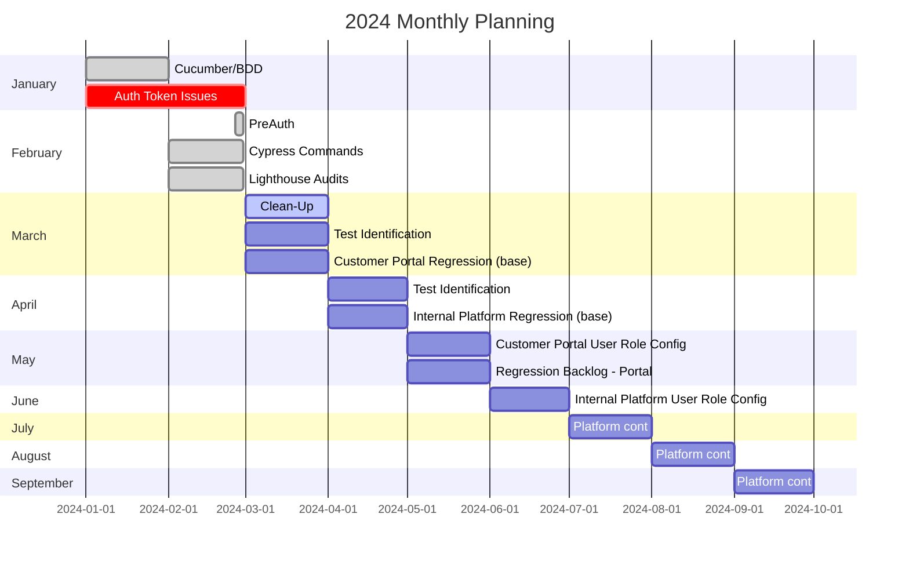
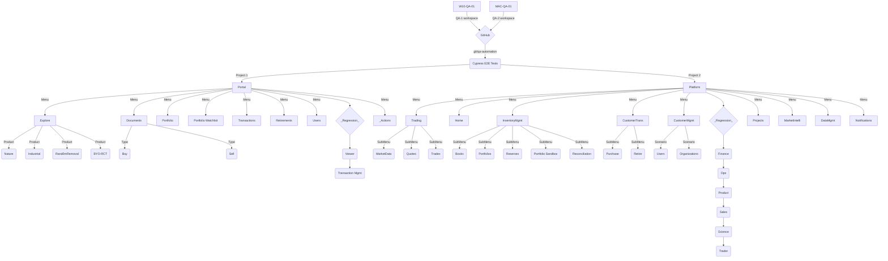
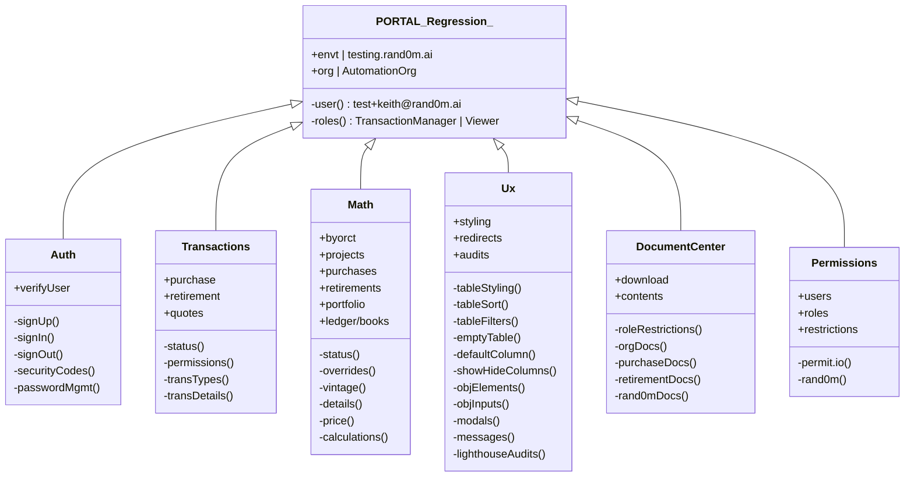
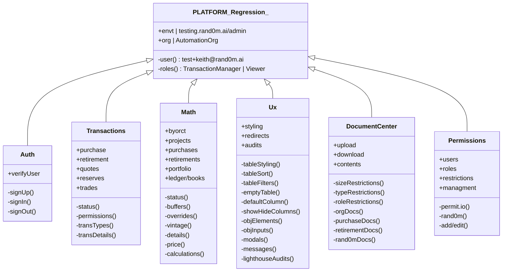
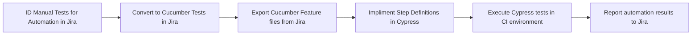
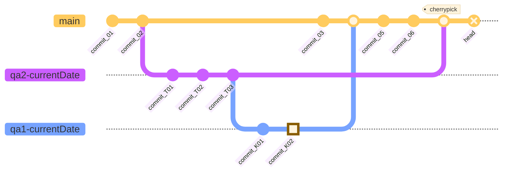

<a name="readme-top"></a>

<!-- TABLE OF CONTENTS -->
<details>
  <summary>Table of Contents</summary>
  <ol>
    <li><a href="#rabbit-hole">Rabbit Hole</a></li>
    <li><a href="#roadmap">Roadmap</a></li>
    <li><a href="#contact">Contact</a></li>
    <li><a href="#environments">Environments</a></li>
    <li><a href="#getting-started">Getting Started</a></li>
    <li><a href="#contributing">Contributing</a></li>
    <li><a href="#repo-structure">Repo Structure</a></li>
    <li><a href="#regression">Regression</a></li>
    <li><a href="#reporting">Reporting</a></li>
    <li><a href="#workflows">Workflows</a></li>
    <li><a href="#more-info">More Info</a></li>
    <li><a href="#tech-stack">Tech Stack</a></li>
  </ol>
</details>

<!-- RABBIT HOLE -->

## <span style="color:#555555" name="rabbit-hole"><u> **ENTER THE RABBIT HOLE** </u></span>

The objective of this project is to implement an automated testing framework that simplifies the testing process, enhances test coverage, and improves overall software quality. The key components and tools used in this project are:

1. **GitHub Source Control:** The project utilizes GitHub for version control and collaborative development. This allows seamless code collaboration, version tracking, and easy integration with other tools in the testing pipeline.

2. **Codefresh CI/CD:** Codefresh is employed for continuous integration and continuous deployment (CI/CD). It automates the build, test, and deployment process, ensuring efficient code integration and reducing the time between code changes and deployment.

3. **Cypress Automation:** Cypress is a powerful end-to-end testing framework used in this project. It provides an intuitive and developer-friendly interface to write and execute tests, making it easier to simulate user interactions and validate the behavior of the application.

4. **Xray Test Management:** Xray serves as the test management tool, enabling effective test planning, execution, and tracking. It integrates seamlessly with the automation framework, allowing the creation of test cases, test execution reports, and traceability of requirements.

5. **Cucumber BDD:** Cucumber is utilized as the behavior-driven development (BDD) framework, enabling the creation of executable specifications in a human-readable format. It promotes collaboration between stakeholders and ensures that test cases align with business requirements.

[![ForScience][ForScience]][ForScience-url]

[![ForDevs][ForDevs]][ForDevs-url]

<p align="right">(<a href="#readme-top">back to top</a>)</p>

<!-- ROADMAP -->

## <span style="color:#555555" name="roadmap"><u> **ROADMAP** </u></span>

Below is a 6 month overview of the previous, current, and future automated testing efforts for `Random Knights, XYZ` and the `Randomly.Engineering` team.



See the (<a href="#regression">REGRESSION</a>) diagram for a full list of proposed automation features, test suites, and test cases.

<!-- CONTACT -->

## <span style="color:#555555" name="contact"><u> **CONTACT** </u></span>

- QA: Keith 🐿️ [gMail](mailto:eng1neer@rand0m.ai)
- GitHub: [https://github.com/qa-kitt/eng1neer](https://github.com/qa-kitt/eng1neer)

<!-- ENVIRONMENTS -->

## <span style="color:#555555" name="environments"><u> **ENVIRONMENTS** </u></span>

- Development
  - [Portal](https://portal.development.rand0m.ai/)
  - [PortalAdmin](https://platform.development.rand0m.ai/)
- Testing - **Automate 1st**
  - [Portal](https://portal.testing.rand0m.ai/)
  - [PortalAdmin](https://platform.testing.rand0m.ai/)
- Staging - **Automate 2nd**
  - [Portal](https://portal.staging.rand0m.ai/)
  - [PortalAdmin](https://platform.staging.rand0m.ai/)
- Sandbox
  - [Portal](https://portal.sandbox.rand0m.ai//)
  - [PortalAdmin](https://platform.sandbox.rand0m.ai//)

<p align="right">(<a href="#readme-top">back to top</a>)</p>

<!-- GETTING STARTED -->

## <span style="color:#555555" name="getting-started"><u> **GETTING STARTED** </u></span>

- VSCode v1.77.3 (system setup) w/Electron: v19.1.11 - **disable auto-updates**
- Cucumber.io: v1.7.0 - **Cucumber (BDD) will not work on higer versions of VSCode**
- Puppeteer: v20.7.4 - provides a high-level API to control Chrome/Chromium over the DevTools Protocol e.g. Google Lighthouse Reports
- @cypress-audit v1.4.0 - **pally and lighthouse only**
- Cypress Cucumber Preprocessor v18.0.4 - working with Gherkin Feature files and Step Definitions (Given/When/Then)

### Prerequisites

- npm
  ```sh
  npm install npm@latest -g
  ```

### Installation

1. Clone the repo
   ```sh
   git clone https://github.com/qa-kitt/eng1neer.git
   ```
2. Install Cypress and Google Lighthouse Audit packages
   ```sh
    npm install --save-dev cypress
    npm install --save-dev puppeteer
    npm install --save-dev @cypress-audit/pa11y
    npm install --save-dev @cypress-audit/lighthouse
   ```
3. Install Cucumber BDD Support packages
   ```sh
    npm install --save-dev cypress-cucumber-preprocessor
    npm instaLL --save-dev @badeball/cypress-cucumber-preprocessor
    npm instaLL --save-dev @bahmutov/cypress-esbuild-preprocessor
   ```
4. Enter your Global Overrides in `cypress.config.js`

   ```js
   const { lighthouse, prepareAudit } = require("@cypress-audit/lighthouse");
   const { pa11y } = require("@cypress-audit/pa11y");
   const { defineConfig } = require("cypress");
   const { cucumber } = require("cypress-cucumber-preprocessor");
   const {
     addCucumberPreprocessorPlugin,
     createEsbuildPlugin,
   } = require("cypress-esbuild-preprocessor");
   const { createBundler } = require("@cypress/webpack-preprocessor");

   module.exports = defineConfig({
     projectId: "<cypress_cloud_project_id>",
     viewportWidth: 1920,
     viewportHeight: 1080,

     e2e: {
       specPattern: "**/*.feature",
       baseUrl: "https://testing.rand0m.ai/",
       defaultCommandTimeout: 7000,
       async setupNodeEvents(on, config) {
         await addCucumberPreprocessorPlugin(on, config);
         on(
           "file:preprocessor",
           createBundler({
             plugins: [createEsbuildPlugin(config)],
           }),
           cucumber(),
         );

         on("before:browser:launch", (browser = {}, launchOptions) => {
           prepareAudit(launchOptions);
         });

         on("task", {
           lighthouse: lighthouse(),
           pa11y: pa11y(console.log.bind(console)),
         });
         return config;
       },
     },
     env: {},
   });
   ```

5. Run in Cypress Cloud (note: @tags allow you to categorize and filter scenarios)

```sh
npx cypress run --record --key '<ProjectKey>' --tag portalTEST_Regression --spec 'cypress/e2e/_portal/*.cy.js'
```

6. Reporting: test run logs and outputs will be automatically sent to [Cypress Cloud](https://cloud.cypress.io/projects/s623zv/runs) and to the internal Slack channel `cypress-automation` (Channel ID: C071C4QRTF0)

<p align="right">(<a href="#readme-top">back to top</a>)</p>

<!-- CONTRIBUTING -->

## <span style="color:#555555" name="contributing"><u> **CONTRIBUTING** </u></span>

If you have a suggestion that would make this better, please fork the repo and create a pull request. You can also simply open an issue with the tag "enhancement".
Don't forget to give the project a star! Thanks again!

1. Fork the Project
2. Create your Feature Branch (`git checkout -b feature/AmazingFeature`)
3. Commit your Changes (`git commit -m 'Add some AmazingFeature'`)
4. Push to the Branch (`git push origin feature/AmazingFeature`)
5. Open a Pull Request

<p align="right">(<a href="#readme-top">back to top</a>)</p>

<!-- REPOS -->

## <span style="color:#555555" name="repo-structure"><u> **REPOS** </u></span>



<p align="right">(<a href="#readme-top">back to top</a>)</p>

<!-- REGRESSION -->

## <span style="color:#555555" name="regression"><u> **REGRESSION** </u></span>





<p align="right">(<a href="#readme-top">back to top</a>)</p>

<!-- REPORTING -->

## <span style="color:#555555" name="reporting"><u> **REPORTING** </u></span>

- [Cypress Cloud | Random Knights, XYZ Project](https://cloud.cypress.io/projects/s623zv/runs)
- [Slack | Cypress-Automation Channel](https://app.slack.com/client/T03JZ77T0FP/C071C4QRTF0)

<!-- WORKFLOWS -->

## <span style="color:#555555" name="workflows"><u> **WORKFLOWS** </u></span>

**Xray <> Cucumber** <small>demo only</small>

_For more information, please visit: [Xray + Cucumber](https://docs.getxray.app/display/XRAY31/Testing+with+Cucumber)_



_For more information on BDD Workflows, please visit: [BDD Manifesto](https://github.com/qa-kitt/eng1neer/blob/main/bdd-manifesto.md)_

<small>\*\*implimentation requires broader team/company engagement</small>

**GitHub**

_For more information, please visit: [GitHub Manifesto](https://github.com/qa-kitt/eng1neer/blob/main/development/git-manifesto.md)_



<p align="right">(<a href="#readme-top">back to top</a>)</p>

<!-- MORE INFO -->

## <span style="color:#555555" name="more-info"><u> **MORE INFO** </u></span>

_For more information on test automation policies and procedures, see [Automation Manifesto](https://github.com/qa-kitt/eng1neer/blob/main/qa/automation-manifesto.md)._

<!-- TECH STACK BADGES -->

## <span style="color:#555555" name="tech-stack"><u> **TECH STACK** </u></span>

### **Workspace**

[![Windows][Windows]][Windows-url]
[![Macbook][Macbook]][Macbook-url]

### **IDE**

[![VSCode][VSCode]][VSCode-url]

### **Source Control**

[![GitHub][GitHub]][GitHub-url]
[![Git][Git]][Git-url]

### **Database**

[![MongoDB][MongoDB]][MongoDB-url]
[![PostgreSQL][PostgreSQL]][PostgreSQL-url]

### **Development**

[![Node.js][Node.js]][Node-url]
[![Python][Python]][Python-url]
[![JavaScript][JavaScript]][JavaScript-url]
[![TypeScript][TypeScript]][TypeScript-url]

### **Testing**

[![Chai.js][Chai.js]][Chai-url]
[![Cucumber][Cucumber]][Cucumber-url]
[![Cypress.js][Cypress.js]][Cypress-url]
[![Jest][Jest]][Jest-url]
[![Lighthouse][Lighthouse]][Lighthouse-url]
[![Mocha.js][Mocha.js]][Mocha-url]
[![Swagger.js][Swagger.js]][Swagger-url]
[![TestLibrary][TestLibrary]][TestLibrary-url]

### **Design**

[![AdobeIllustrator][AdobeIllustrator]][Illustrator-url]
[![Canva][Canva]][Canva-url]
[![Figma][Figma]][Figma-url]

### **Pipelines**

[![Slack][Slack]][Slack-url]
[![CypressCloud][CypressCloud]][CypressCloud-url]

<p align="right">(<a href="#readme-top">back to top</a>)</p>

<!-- MARKDOWN LINKS & IMAGES -->
<!-- https://www.markdownguide.org/basic-syntax/#reference-style-links -->

[contributors-shield]: https://img.shields.io/github/contributors/repo_name.svg?style=for-the-badge
[contributors-url]: https://github.com/qa-kitt/repo_name/graphs/contributors
[forks-shield]: https://img.shields.io/github/forks/repo_name.svg?style=for-the-badge
[forks-url]: https://github.com/qa-kitt/repo_name/network/members
[stars-shield]: https://img.shields.io/github/stars/repo_name.svg?style=for-the-badge
[stars-url]: https://github.com/qa-kitt/stargazers
[issues-shield]: https://img.shields.io/github/issues/repo_name.svg?style=for-the-badge
[issues-url]: https://github.com/qa-kitt/repo_name/issues
[license-shield]: https://img.shields.io/github/license/repo_name.svg?style=for-the-badge
[license-url]: https://github.com/qa-kitt/repo_name/blob/master/LICENSE.txt

<!-- WORKSPACE BADGES -->

[Windows]: https://img.shields.io/badge/Windows-Lenovo_ThinkPad_S7-CADDC4?style=for-the-badge&logo=windows&logoColor=white
[Windows-url]: https://www.lenovo.com/us/en/p/laptops/legion-laptops/legion-7-series/legion-s7-15ach6/88gmy701595/
[Macbook]: https://img.shields.io/badge/Apple-MacBook_Pro_2022-CADDC4?style=for-the-badge&logo=apple&logoColor=white
[Macbook-url]: https://www.apple.com/macbook-pro-14-and-16/

<!-- IDE BADGES -->

[VSCode]: https://img.shields.io/badge/Visual_Studio_Code-9AB79A?style=for-the-badge&logo=visual%20studio%20code&logoColor=white
[VSCode-url]: https://www.vscode.com

<!-- SOURCE CONTROL BADGES -->

[GitHub]: https://img.shields.io/badge/GitHub-7A997A?style=for-the-badge&logo=github&logoColor=white
[GitHub-url]: https://github.com/
[GitHubActions]: https://img.shields.io/badge/GitHub_Actions-2088FF?style=for-the-badge&logo=github-actions&logoColor=white
[GitHubActions-url]: https://github.com/features/actions
[Git]: https://img.shields.io/badge/GIT-7A997A?style=for-the-badge&logo=git&logoColor=white
[Git-url]: https://git-scm.com/

<!-- DATABASE BADGES -->

[MongoDB]: https://img.shields.io/badge/MongoDB-426442?style=for-the-badge&logo=mongodb&logoColor=white
[MongoDB-url]: https://www.mongodb.com/
[PostgreSQL]: https://img.shields.io/badge/PostgreSQL-426442?style=for-the-badge&logo=postgresql&logoColor=white
[PostgreSQL-url]: https://www.postgresql.org/

<!-- DEVELOPMENT BADGES -->

[ForDevs]: https://forthebadge.com/images/badges/built-by-developers.svg
[ForDevs-url]: https://dev.to/
[ForScience]: https://forthebadge.com/images/badges/built-with-science.svg
[ForScience-url]: https://forthebadge.com
[JavaScript]: https://img.shields.io/badge/JavaScript-274727?style=for-the-badge&logo=javascript&logoColor=F7DF1E
[JavaScript-url]: https://www.javascript.com/
[Node.js]: https://img.shields.io/badge/Node.js-274727?style=for-the-badge&logo=node.js&logoColor=white
[Node-url]: https://nodejs.org/en
[Python]: https://img.shields.io/badge/Python-274727?style=for-the-badge&logo=python&logoColor=white
[Python-url]: https://www.python.org/
[TypeScript]: https://img.shields.io/badge/TypeScript-274727?style=for-the-badge&logo=typescript&logoColor=1572B6
[TypeScript-url]: https://www.typescript.com/

<!-- TESTING BADGES -->

[Chai.js]: https://img.shields.io/badge/chai.js-183718?style=for-the-badge&logo=chai&logoColor=white
[Chai-url]: https://www.chaijs.com/
[Cucumber]: https://img.shields.io/badge/cucumber-183718?style=for-the-badge&logo=cucumber&logoColor=white
[Cucumber-url]: https://cucumber.io/
[Cypress.js]: https://img.shields.io/badge/cypress-183718?style=for-the-badge&logo=cypress&logoColor=white
[Cypress-url]: https://www.cypress.io/
[Jest]: https://img.shields.io/badge/Jest-183718?style=for-the-badge&logo=Jest&logoColor=white
[Jest-url]: https://jestjs.io/
[Lighthouse]: https://img.shields.io/badge/Google_Lighthouse-183718?style=for-the-badge&logo=lighthouse&logoColor=white
[Lighthouse-url]: https://developer.chrome.com/docs/lighthouse/overview/
[Mocha.js]: https://img.shields.io/badge/mocha.js-183718?style=for-the-badge&logo=mocha&logoColor=white
[Mocha-url]: https://mochajs.org/
[Swagger.js]: https://img.shields.io/badge/swagger-183718?style=for-the-badge&logo=swagger&logoColor=white
[Swagger-url]: https://swagger.io/docs/
[TestLibrary]: https://img.shields.io/badge/testing%20library-183718?style=for-the-badge&logo=testing-library&logoColor=white
[TestLibrary-url]: https://testing-library.com/

<!-- DESIGN BADGES -->

[AdobeIllustrator]: https://img.shields.io/badge/Adobe%20Illustrator-113011?style=for-the-badge&logo=adobe%20illustrator&logoColor=white
[Illustrator-url]: https://www.adobe.com/creativecloud/products/illustrator.html
[Canva]: https://img.shields.io/badge/Canva-113011.svg?&style=for-the-badge&logo=Canva&logoColor=white
[Canva-url]: https://canva.com
[Figma]: https://img.shields.io/badge/Figma-113011?style=for-the-badge&logo=figma&logoColor=white
[Figma-url]: https://www.figma.com
[Framer]: https://img.shields.io/badge/Framer-black?style=for-the-badge&logo=framer&logoColor=blue
[Framer-url]: https://www.framer.com/

<!-- PIPELINE BADGES -->

[Slack]: https://img.shields.io/badge/slack-071E07?style=for-the-badge&logo=Slack
[Slack-url]: https://www.slack.com/
[CypressCloud]: https://img.shields.io/badge/cypress_cloud-071E07?style=for-the-badge&logo=cypress&logoColor=white
[CypressCloud-url]: https://www.cypress.io/
